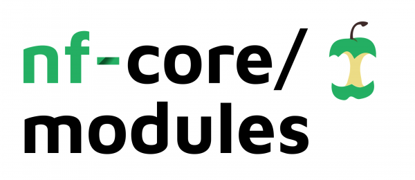

# 

[](https://www.nextflow.io/)
[](https://docs.conda.io/en/latest/)
[](https://www.docker.com/)
[](https://sylabs.io/docs/)


[](https://nfcore.slack.com/channels/modules)

[](https://twitter.com/nf_core)
[](https://www.youtube.com/c/nf-core)

> THIS REPOSITORY IS UNDER ACTIVE DEVELOPMENT. SYNTAX, ORGANISATION AND LAYOUT MAY CHANGE WITHOUT NOTICE!  
> PLEASE BE KIND TO OUR CODE REVIEWERS AND SUBMIT ONE PULL REQUEST PER MODULE :)

A repository for hosting [Nextflow DSL2](https://www.nextflow.io/docs/latest/dsl2.html) module files containing tool-specific process definitions and their associated documentation.

## Table of contents

- [Using existing modules](#using-existing-modules)
- [Adding a new module file](#adding-a-new-module-file)
    - [Checklist](#checklist)
    - [nf-core modules create](#nf-core-modules-create)
    - [Test data](#test-data)
    - [Uploading to `nf-core/modules`](#uploading-to-nf-coremodules)
    - [Guidelines](#guidelines)
- [Terminology](#terminology)
- [Nextflow edge releases](#nextflow-edge-releases)
- [Help](#help)
- [Citation](#citation)

## Using existing modules

The module files hosted in this repository define a set of processes for software tools such as `fastqc`, `bwa`, `samtools` etc. This allows you to share and add common functionality across multiple pipelines in a modular fashion.

We have written a helper command in the `nf-core/tools` package that uses the GitHub API to obtain the relevant information for the module files present in the [`software/`](software/) directory of this repository. This includes using `git` commit hashes to track changes for reproducibility purposes, and to download and install all of the relevant module files.

1. Install the latest version of [`nf-core/tools`](https://github.com/nf-core/tools#installation) (`>=1.13`)
2. List the available modules:

    ```console
    $ nf-core modules list
    
                                          ,--./,-.
          ___     __   __   __   ___     /,-._.--~\
    |\ | |__  __ /  ` /  \ |__) |__         }  {
    | \| |       \__, \__/ |  \ |___     \`-._,-`-,
                                          `._,._,'

    nf-core/tools version 1.13

    INFO     Modules available from nf-core/modules (master):                       pipeline_modules.py:164

    ┏━━━━━━━━━━━━━━━━━━━━━━━━━━━━━━━━┓
    ┃ Module Name                    ┃
    ┡━━━━━━━━━━━━━━━━━━━━━━━━━━━━━━━━┩
    │ bandage/image                  │
    │ bcftools/consensus             │
    │ bcftools/filter                │
    │ bcftools/isec                  │
    ..truncated..
    ```

3. Install the module in your pipeline directory:

    ```console
    $ nf-core modules install . --tool fastqc

                                          ,--./,-.
          ___     __   __   __   ___     /,-._.--~\
    |\ | |__  __ /  ` /  \ |__) |__         }  {
    | \| |       \__, \__/ |  \ |___     \`-._,-`-,
                                          `._,._,'

    nf-core/tools version 1.13

    INFO     Installing fastqc                                                      pipeline_modules.py:213
    INFO     Downloaded 3 files to ./modules/nf-core/software/fastqc                pipeline_modules.py:236
    ```

4. Import the module in your Nextflow script:

    ```nextflow
    #!/usr/bin/env nextflow

    nextflow.enable.dsl = 2

    include { FASTQC } from './modules/nf-core/software/fastqc/main' addParams( options: [:] )
    ```

5. Remove the module from the pipeline repository if required:

    ```console
    $ nf-core modules remove . --tool fastqc

                                          ,--./,-.
          ___     __   __   __   ___     /,-._.--~\
    |\ | |__  __ /  ` /  \ |__) |__         }  {
    | \| |       \__, \__/ |  \ |___     \`-._,-`-,
                                          `._,._,'

    nf-core/tools version 1.13

    INFO     Removing fastqc                                                        pipeline_modules.py:271
    INFO     Successfully removed fastqc                                            pipeline_modules.py:285
    ```

6. Check that a locally installed nf-core module is up-to-date compared to the one hosted in this repo:

    ```console
    $ nf-core modules lint . --tool fastqc

                                          ,--./,-.
          ___     __   __   __   ___     /,-._.--~\
    |\ | |__  __ /  ` /  \ |__) |__         }  {
    | \| |       \__, \__/ |  \ |___     \`-._,-`-,
                                          `._,._,'

    nf-core/tools version 1.13

    INFO     Linting pipeline: .                                                    lint.py:104
    INFO     Linting module: fastqc                                                 lint.py:106

    ╭─────────────────────────────────────────────────────────────────────────────────╮
    │ [!] 1 Test Warning                                                              │
    ╰─────────────────────────────────────────────────────────────────────────────────╯
    ╭──────────────┬───────────────────────────────┬──────────────────────────────────╮
    │ Module name  │ Test message                  │ File path                        │
    ├──────────────┼───────────────────────────────┼──────────────────────────────────┤
    │ fastqc       │ Local copy of module outdated │ modules/nf-core/software/fastqc/ │
    ╰──────────────┴────────────────────────────── ┴──────────────────────────────────╯
    ╭──────────────────────╮
    │ LINT RESULTS SUMMARY │
    ├──────────────────────┤
    │ [✔]  15 Tests Passed │
    │ [!]   1 Test Warning │
    │ [✗]   0 Test Failed  │
    ╰──────────────────────╯
    ```

We have plans to add other utility commands to help developers install and maintain modules downloaded from this repository so watch this space e.g. `nf-core modules update` command to automatically check and update modules installed within the pipeline.

## Adding a new module file

If you decide to upload a module to `nf-core/modules` then this will
ensure that it will become available to all nf-core pipelines,
and to everyone within the Nextflow community! See
[`software/`](software)
for examples.

### Checklist

Please check that the module you wish to add isn't already on [`nf-core/modules`](https://github.com/nf-core/modules/tree/master/software):
- Use the [`nf-core modules list`](https://github.com/nf-core/tools#list-modules) command
- Check [open pull requests](https://github.com/nf-core/modules/pulls)
- Search [open issues](https://github.com/nf-core/modules/issues)

If the module doesn't exist on `nf-core/modules`:
- Please create a [new issue](https://github.com/nf-core/modules/issues/new?assignees=&labels=new%20module&template=new_nodule.md&title=new%20module:) before adding it
- Set an appropriate subject for the issue e.g. `new module: fastqc`
- Add yourself to the `Assignees` so we can track who is working on the module

### nf-core modules create

We have implemented a number of commands in the `nf-core/tools` package to make it incredibly easy for you to create and contribute your own modules to nf-core/modules.

1. Install the latest version of [`nf-core/tools`](https://github.com/nf-core/tools#installation) (`>=1.13`)
2. Install [`nextflow`](https://nf-co.re/usage/installation) (`>=20.11.0-edge`; see [Nextflow edge releases](#nextflow-edge-releases))
3. Install any of [`Docker`](https://docs.docker.com/engine/installation/), [`Singularity`](https://www.sylabs.io/guides/3.0/user-guide/) or [`Conda`](https://conda.io/miniconda.html)
4. [Fork and clone this repo locally](#uploading-to-nf-coremodules)
5. Create a module using the [nf-core DSL2 module template](https://github.com/nf-core/tools/blob/master/nf_core/module-template/software/main.nf):

    ```console
    $ nf-core modules create . --tool fastqc --author @joebloggs --label process_low --meta

                                          ,--./,-.
          ___     __   __   __   ___     /,-._.--~\
    |\ | |__  __ /  ` /  \ |__) |__         }  {
    | \| |       \__, \__/ |  \ |___     \`-._,-`-,
                                          `._,._,'

    nf-core/tools version 1.13

    INFO     Using Bioconda package: 'bioconda::fastqc=0.11.9'                      create.py:130
    INFO     Using Docker / Singularity container with tag: 'fastqc:0.11.9--0'      create.py:140
    INFO     Created / edited following files:                                      create.py:218
                ./software/fastqc/functions.nf
                ./software/fastqc/main.nf
                ./software/fastqc/meta.yml
                ./tests/software/fastqc/main.nf
                ./tests/software/fastqc/test.yml
                ./tests/config/pytest_software.yml
    ```

    All of the files required to add the module to `nf-core/modules` will be created/edited in the appropriate places. The 4 files you will need to change are:

    1. [`./software/fastqc/main.nf`](https://github.com/nf-core/modules/blob/master/software/fastqc/main.nf)

        This is the main script containing the `process` definition for the module. You will see an extensive number of `TODO` statements to help guide you to fill in the appropriate sections and to ensure that you adhere to the guidelines we have set for module submissions.

    2. [`./software/fastqc/meta.yml`](https://github.com/nf-core/modules/blob/master/software/fastqc/meta.yml)

        This file will be used to store general information about the module and author details - the majority of which will already be auto-filled. However, you will need to add a brief description of the files defined in the `input` and `output` section of the main script since these will be unique to each module.

    3. [`./tests/software/fastqc/main.nf`](https://github.com/nf-core/modules/blob/master/tests/software/fastqc/main.nf)

        Every module MUST have a test workflow. This file will define one or more Nextflow `workflow` definitions that will be used to unit test the output files created by the module. By default, one `workflow` definition will be added but please feel free to add as many as possible so we can ensure that the module works on different data types / parameters e.g. separate `workflow` for single-end and paired-end data.

        Minimal test data required for your module may already exist within this repository, in which case you may just have to change a couple of paths in this file - see the [Test data](#test-data) section for more info and guidelines for adding new standardised data if required.

    4. [`./tests/software/fastqc/test.yml`](https://github.com/nf-core/modules/blob/master/tests/software/fastqc/test.yml)

        This file will contain all of the details required to unit test the main script in the point above using [pytest-workflow](https://pytest-workflow.readthedocs.io/). If possible, any outputs produced by the test workflow(s) MUST be included and listed in this file along with an appropriate check e.g. md5sum. The different test options are listed in the [pytest-workflow docs](https://pytest-workflow.readthedocs.io/en/stable/#test-options).

        As highlighted in the next point, we have added a command to make it much easier to test the workflow(s) defined for the module and to automatically create the `test.yml` with the md5sum hashes for all of the outputs generated by the module.

        `md5sum` checks are the preferable choice of test to determine file changes, however, this may not be possible for all outputs generated by some tools e.g. if they include time stamps or command-related headers. Please do your best to avoid just checking for the file being present e.g. it may still be possible to check that the file contains the appropriate text snippets.

6. Create a yaml file containing information required for module unit testing

    ```console
    $ nf-core modules create-test-yml

                                          ,--./,-.
          ___     __   __   __   ___     /,-._.--~\
    |\ | |__  __ /  ` /  \ |__) |__         }  {
    | \| |       \__, \__/ |  \ |___     \`-._,-`-,
                                          `._,._,'

    nf-core/tools version 1.13


    INFO     Press enter to use default values (shown in brackets) or type your own responses                                             test_yml_builder.py:51
    ? Tool name: fastqc
    Test YAML output path (- for stdout) (tests/software/fastqc/test.yml):
    INFO     Looking for test workflow entry points: 'tests/software/fastqc/main.nf'                                                      test_yml_builder.py:116
    INFO     Building test meta for entry point 'test_fastqc_single_end'                                                                  test_yml_builder.py:150
    Test name (fastqc test_fastqc_single_end):
    Test command (nextflow run tests/software/fastqc -entry test_fastqc_single_end -c tests/config/nextflow.config):
    Test tags (comma separated) (fastqc,fastqc_single_end):
    Test output folder with results (leave blank to run test):
    ? Choose software profile Singularity
    INFO     Setting env var '$PROFILE' to 'singularity'                                                                                  test_yml_builder.py:258
    INFO     Running 'fastqc' test with command:                                                                                          test_yml_builder.py:263
             nextflow run tests/software/fastqc -entry test_fastqc_single_end -c tests/config/nextflow.config --outdir /tmp/tmpgbneftf5
    INFO     Test workflow finished!                                                                                                      test_yml_builder.py:276
    INFO     Writing to 'tests/software/fastqc/test.yml'                                                                                  test_yml_builder.py:293
    ```

7. Lint the module locally to check that it adheres to nf-core guidelines before submission

    ```console
    $ nf-core modules lint . --tool fastqc

                                          ,--./,-.
          ___     __   __   __   ___     /,-._.--~\
    |\ | |__  __ /  ` /  \ |__) |__         }  {
    | \| |       \__, \__/ |  \ |___     \`-._,-`-,
                                          `._,._,'

    nf-core/tools version 1.13

    INFO     Linting modules repo: .                                                lint.py:102
    INFO     Linting module: fastqc                                                 lint.py:106

    ╭────────────────────────────────────────────────────────────────────────────────────────────────────────────────╮
    │ [!] 3 Test Warnings                                                                                            │
    ╰────────────────────────────────────────────────────────────────────────────────────────────────────────────────╯
    ╭──────────────┬──────────────────────────────────────────────────────────────┬──────────────────────────────────╮
    │ Module name  │ Test message                                                 │ File path                        │
    ├──────────────┼──────────────────────────────────────────────────────────────┼──────────────────────────────────┤
    │ fastqc       │ TODO string in meta.yml: #Add a description of the module... │ modules/nf-core/software/fastqc/ │
    │ fastqc       │ TODO string in meta.yml: #Add a description and other det... │ modules/nf-core/software/fastqc/ │
    │ fastqc       │ TODO string in meta.yml: #Add a description of all of the... │ modules/nf-core/software/fastqc/ │
    ╰──────────────┴──────────────────────────────────────────────────────────────┴──────────────────────────────────╯
    ╭────────────────────────────────────────────────────────────────────────────────────────────────────────────────╮
    │ [!] 1 Test Failed                                                                                              │
    ╰────────────────────────────────────────────────────────────────────────────────────────────────────────────────╯
    ╭──────────────┬──────────────────────────────────────────────────────────────┬──────────────────────────────────╮
    │ Module name  │ Test message                                                 │ File path                        │
    ├──────────────┼──────────────────────────────────────────────────────────────┼──────────────────────────────────┤
    │ fastqc       │ 'meta' map not emitted in output channel(s)                  │ modules/nf-core/software/fastqc/ │
    ╰──────────────┴──────────────────────────────────────────────────────────────┴──────────────────────────────────╯
    ╭──────────────────────╮
    │ LINT RESULTS SUMMARY │
    ├──────────────────────┤
    │ [✔]  38 Tests Passed │
    │ [!]   3 Test Warning │
    │ [✗]   1 Test Failed  │
    ╰──────────────────────╯
    ```

### Test data

In order to test that each module added to `nf-core/modules` is actually working and to be able to track any changes to results files between module updates we have set-up a number of Github Actions CI tests to run each module on a minimal test dataset using Docker, Singularity and Conda.

- All test data for `nf-core/modules` MUST be added to [`tests/data/`](tests/data/) and organised by filename extension.

- In order to keep the size of this repository as minimal as possible, pre-existing files from [`tests/data/`](tests/data/) MUST be reused if at all possible.

- Test files MUST be kept as tiny as possible.

### Uploading to `nf-core/modules`

[Fork](https://help.github.com/articles/fork-a-repo/) the `nf-core/modules` repository to your own GitHub account. Within the local clone of your fork add the module file to the [`software/`](software) directory. Please try and keep PRs as atomic as possible to aid the reviewing process - ideally, one module addition/update per PR.

Commit and push these changes to your local clone on GitHub, and then [create a pull request](https://help.github.com/articles/creating-a-pull-request-from-a-fork/) on the `nf-core/modules` GitHub repo with the appropriate information.

We will be notified automatically when you have created your pull request, and providing that everything adheres to nf-core guidelines we will endeavour to approve your pull request as soon as possible.

### Guidelines

The key words "MUST", "MUST NOT", "SHOULD", etc. are to be interpreted as described in [RFC 2119](https://tools.ietf.org/html/rfc2119).

#### General

- Software that can be piped together SHOULD be added to separate module files
unless there is a run-time, storage advantage in implementing in this way. For example,
using a combination of `bwa` and `samtools` to output a BAM file instead of a SAM file:

    ```bash
    bwa mem | samtools view -B -T ref.fasta
    ```

- Where applicable, the usage and generation of compressed files SHOULD be enforced as input and output, respectively:
    - `*.fastq.gz` and NOT `*.fastq`
    - `*.bam` and NOT `*.sam`

- Where applicable, each module command MUST emit a file `<SOFTWARE>.version.txt` containing a single line with the software's version in the format `<VERSION_NUMBER>` or `0.7.17` e.g.

    ```bash
    echo \$(bwa 2>&1) | sed 's/^.*Version: //; s/Contact:.*\$//' > ${software}.version.txt
    ```

    If the software is unable to output a version number on the command-line then a variable called `VERSION` can be manually specified to create this file e.g. [homer/annotatepeaks module](https://github.com/nf-core/modules/blob/master/software/homer/annotatepeaks/main.nf).

- The process definition MUST NOT contain a `when` statement.

#### Naming conventions

- The directory structure for the module name must be all lowercase e.g. [`software/bwa/mem/`](software/bwa/mem/). The name of the software (i.e. `bwa`) and tool (i.e. `mem`) MUST be all one word.

- The process name in the module file MUST be all uppercase e.g. `process BWA_MEM {`. The name of the software (i.e. `BWA`) and tool (i.e. `MEM`) MUST be all one word separated by an underscore.

- All parameter names MUST follow the `snake_case` convention.

- All function names MUST follow the `camelCase` convention.

#### Module parameters

- A module file SHOULD only define input and output files as command-line parameters to be executed within the process.

- All other parameters MUST be provided as a string i.e. `options.args` where `options` is a Groovy Map that MUST be provided via the Nextflow `addParams` option when including the module via `include` in the parent workflow.

- If the tool supports multi-threading then you MUST provide the appropriate parameter using the Nextflow `task` variable e.g. `--threads $task.cpus`.

- Any parameters that need to be evaluated in the context of a particular sample e.g. single-end/paired-end data MUST also be defined within the process.

#### Input/output options

- Named file extensions MUST be emitted for ALL output channels e.g. `path "*.txt", emit: txt`.

- Optional inputs are not currently supported by Nextflow. However, "fake files" MAY be used to work around this issue.

#### Resource requirements

- An appropriate resource `label` MUST be provided for the module as listed in the [nf-core pipeline template](https://github.com/nf-core/tools/blob/master/nf_core/pipeline-template/%7B%7Bcookiecutter.name_noslash%7D%7D/conf/base.config#L29) e.g. `process_low`, `process_medium` or `process_high`.

- If the tool supports multi-threading then you MUST provide the appropriate parameter using the Nextflow `task` variable e.g. `--threads $task.cpus`.

#### Software requirements

[BioContainers](https://biocontainers.pro/#/) is a registry of Docker and Singularity containers automatically created from all of the software packages on [Bioconda](https://bioconda.github.io/). Where possible we will use BioContainers to fetch pre-built software containers and Bioconda to install software using Conda.

- Software requirements SHOULD be declared within the module file using the Nextflow `container` directive. For single-tool BioContainers, the `nf-core modules create` command will automatically fetch and fill-in the appropriate Conda / Docker / Singularity definitions by parsing the information provided in the first part of the module name:

    ```nextflow
    conda (params.enable_conda ? "bioconda::bwa=0.7.17" : null)                         // Conda package
    if (workflow.containerEngine == 'singularity' && !params.singularity_pull_docker_container) {
        container "https://depot.galaxyproject.org/singularity/bwa:0.7.17--hed695b0_7"  // Singularity image
    } else {
        container "quay.io/biocontainers/bwa:0.7.17--hed695b0_7"                        // Docker image
    }
    ```

- If the software is available on Conda it MUST also be defined using the Nextflow `conda` directive. Using `bioconda::bwa=0.7.17` as an example, software MUST be pinned to the channel (i.e. `bioconda`) and version (i.e. `0.7.17`). Conda packages MUST not be pinned to a build because they can vary on different platforms.

- If required, multi-tool containers may also be available on BioContainers e.g. [`bwa` and `samtools`](https://biocontainers.pro/#/tools/mulled-v2-fe8faa35dbf6dc65a0f7f5d4ea12e31a79f73e40). You can install and use the [`galaxy-tool-util`](https://anaconda.org/bioconda/galaxy-tool-util) package to search for both single- and multi-tool containers available in Conda, Docker and Singularity format. e.g. to search for Docker (hosted on Quay.io) and Singularity multi-tool containers with both `bowtie` and `samtools` installed you can use the following command:

    ```console
    mulled-search --destination quay singularity --channel bioconda --search bowtie samtools | grep "mulled"
    ```

    > NB: Build information for all tools within a multi-tool container can be obtained in the `/usr/local/conda-meta/history` file within the container.

- It is also possible for a new multi-tool container to be built and added to BioContainers by submitting a pull request on their [`multi-package-containers`](https://github.com/BioContainers/multi-package-containers) repository.
    - Fork the [multi-package-containers repository](https://github.com/BioContainers/multi-package-containers)
    - Make a change to the hash.tsv file in the combinations directory see [here](https://github.com/aunderwo/multi-package-containers/blob/master/combinations/hash.tsv#L124) for an example where I added pysam=0.16.0.1,biopython=1.78
    - Commit the code and then make a pull request to the original repo for [example](https://github.com/BioContainers/multi-package-containers/pull/1661)
    - Once the PR has been accepted a container will get built and you can find it using  a search tool in the `galaxy-tool-util conda` package
      ```
      mulled-search --destination quay singularity conda  --search pysam biopython  | grep "mulled"
      quay         mulled-v2-3a59640f3fe1ed11819984087d31d68600200c3f  185a25ca79923df85b58f42deb48f5ac4481e91f-0  docker pull quay.io/biocontainers/mulled-v2-3a59640f3fe1ed11819984087d31d68600200c3f:185a25ca79923df85b58f42deb48f5ac4481e91f-0
      singularity  mulled-v2-3a59640f3fe1ed11819984087d31d68600200c3f  185a25ca79923df85b58f42deb48f5ac4481e91f-0  wget https://depot.galaxyproject.org/singularity/mulled-v2-3a59640f3fe1ed11819984087d31d68600200c3f:185a25ca79923df85b58f42deb48f5ac4481e91f-0
      ```
    - These can be used to add to the relevant docker and singularity lines in the PROCESS definition
    - To confirm that this is correct. Spin up a temporary Docker container
      ```
      docker run --rm -it quay.io/biocontainers/mulled-v2-3a59640f3fe1ed11819984087d31d68600200c3f:185a25ca79923df85b58f42deb48f5ac4481e91f-0  /bin/sh
      ```
      And in the command prompt type
      ```
      / # grep specs /usr/local/conda-meta/history
      # update specs: ['biopython=1.78', 'pysam=0.16.0.1']
      ```
      The packages should reflect those added to the multi-package-containers repo `hash.tsv` file
 
- If the software is not available on Bioconda a `Dockerfile` MUST be provided within the module directory. We will use GitHub Actions to auto-build the containers on the [GitHub Packages registry](https://github.com/features/packages).

#### Publishing results

The [Nextflow `publishDir`](https://www.nextflow.io/docs/latest/process.html#publishdir) definition is currently quite limited in terms of parameter/option evaluation. To overcome this, the publishing logic we have implemented for use with DSL2 modules attempts to minimise changing the `publishDir` directive (default: `params.outdir`) in favour of constructing and appending the appropriate output directory paths via the `saveAs:` statement e.g.

```nextflow
publishDir "${params.outdir}",
    mode: params.publish_dir_mode,
    saveAs: { filename -> saveFiles(filename:filename, options:params.options, publish_dir:getSoftwareName(task.process), publish_id:meta.id) }
```

The `saveFiles` function can be found in the [`functions.nf`](software/fastqc/functions.nf) file of utility functions that will be copied into all module directories. It uses the various publishing `options` specified as input to the module to construct and append the relevant output path to `params.outdir`.

We also use a standardised parameter called `params.publish_dir_mode` that can be used to alter the file publishing method (default: `copy`).

## Terminology

The features offered by Nextflow DSL2 can be used in various ways depending on the granularity with which you would like to write pipelines. Please see the listing below for the hierarchy and associated terminology we have decided to use when referring to DSL2 components:

- *Module*: A `process` that can be used within different pipelines and is as atomic as possible i.e. cannot be split into another module. An example of this would be a module file containing the process definition for a single tool such as `FastQC`. At present, this repository has been created to only host atomic module files that should be added to the [`software/`](software/) directory along with the required documentation and tests.

- *Sub-workflow*: A chain of multiple modules that offer a higher-level of functionality within the context of a pipeline. For example, a sub-workflow to run multiple QC tools with FastQ files as input. Sub-workflows should be shipped with the pipeline implementation and if required they should be shared amongst different pipelines directly from there. As it stands, this repository will not host sub-workflows although this may change in the future since well-written sub-workflows will be the most powerful aspect of DSL2.

- *Workflow*: What DSL1 users would consider an end-to-end pipeline. For example, from one or more inputs to a series of outputs. This can either be implemented using a large monolithic script as with DSL1, or by using a combination of DSL2 individual modules and sub-workflows.

## Nextflow edge releases

Stable releases will be becoming more infrequent as Nextflow shifts its development model to becoming more dynamic via the usage of plugins. This will allow functionality to be added as an extension to the core codebase with a release cycle that could potentially be independent to that of Nextflow itself. As a result of the reduction in stable releases, some pipelines may be required to use Nextflow `edge` releases in order to be able to exploit cutting "edge" features e.g. version 3.0 of the nf-core/rnaseq pipeline requires Nextflow `>=20.11.0-edge` in order to be able to directly download Singularity containers over `http` (see [nf-core/rnaseq#496](https://github.com/nf-core/rnaseq/issues/496)).

There are a number of ways you can install Nextflow `edge` releases, the main difference with stable releases being that you have to `export` the version you would like to install before issuing the appropriate installation/execution commands as highlighted below.

- If you would like to download and install a Nextflow `edge` release from scratch with minimal fuss:

    ```bash
    export NXF_VER="20.11.0-edge"
    wget -qO- get.nextflow.io | bash
    sudo mv nextflow /usr/local/bin/
    nextflow run nf-core/rnaseq -profile test,docker -r 3.0
    ```

    > Note if you don't have `sudo` privileges required for the last command above then you can move the `nextflow` binary to somewhere else and export that directory to `$PATH` instead. One way of doing that on Linux would be to add `export PATH=$PATH:/path/to/nextflow/binary/` to your `~/.bashrc` file so that it is available every time you login to your system.

- Manually download and install Nextflow from the available [assets](https://github.com/nextflow-io/nextflow/releases) on Github. See [Nextflow installation docs](https://www.nextflow.io/docs/latest/getstarted.html#installation).

## Help

For further information or help, don't hesitate to get in touch on [Slack `#modules` channel](https://nfcore.slack.com/channels/modules) (you can join with [this invite](https://nf-co.re/join/slack)).

## Citation

If you use the module files in this repository for your analysis please you can cite the `nf-core` publication as follows:

> **The nf-core framework for community-curated bioinformatics pipelines.**
>
> Philip Ewels, Alexander Peltzer, Sven Fillinger, Harshil Patel, Johannes Alneberg, Andreas Wilm, Maxime Ulysse Garcia, Paolo Di Tommaso & Sven Nahnsen.
>
> _Nat Biotechnol._ 2020 Feb 13. doi: [10.1038/s41587-020-0439-x](https://dx.doi.org/10.1038/s41587-020-0439-x).

<!---

### Offline usage

If you want to use an existing module file available in `nf-core/modules`, and you're running on a system that has no internet connection, you'll need to download the repository (e.g. `git clone https://github.com/nf-core/modules.git`) and place it in a location that is visible to the file system on which you are running the pipeline. Then run the pipeline by creating a custom config file called e.g. `custom_module.conf` containing the following information:

```bash
include /path/to/downloaded/modules/directory/
```

Then you can run the pipeline by directly passing the additional config file with the `-c` parameter:

```bash
nextflow run /path/to/pipeline/ -c /path/to/custom_module.conf
```

> Note that the nf-core/tools helper package has a `download` command to download all required pipeline
> files + singularity containers + institutional configs + modules in one go for you, to make this process easier.

-->
