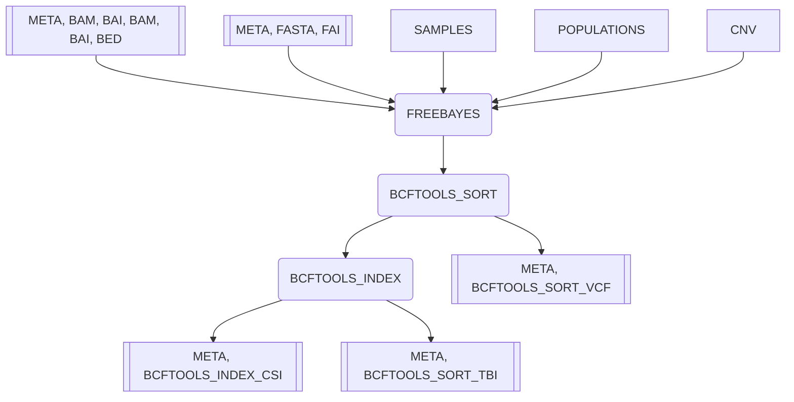

```mermaid
flowchart TB
    A[[META, BAM, BAI, BAM, BAI, BED]] & B[[META, FASTA, FAI]] & C[SAMPLES] & D[POPULATIONS] & E[CNV] --> F(FREEBAYES)
    F --> G(BCFTOOLS_SORT)
    G --> H(BCFTOOLS_INDEX)
    G --> I[[META, BCFTOOLS_SORT_VCF]]
    H --> J[[META, BCFTOOLS_INDEX_CSI]] & K[[META, BCFTOOLS_SORT_TBI]]
```
